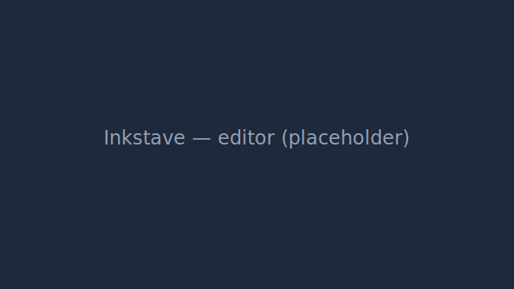
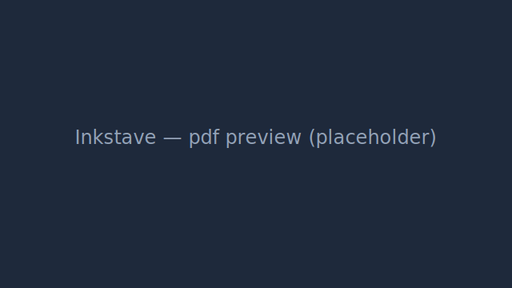
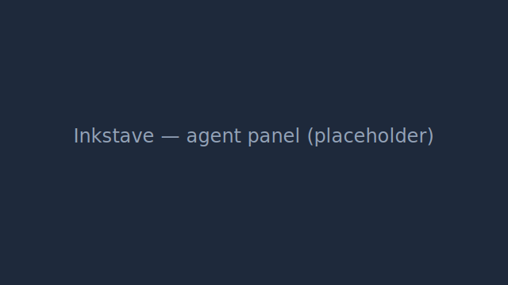

# Inkstave

> An open-source, real-time collaborative LaTeX editor with a built-in AI writing agent.

Inkstave is a from-scratch system **inspired by** [Overleaf Community Edition](https://github.com/overleaf/overleaf).
It is **not** a fork and shares **no source code** with Overleaf. The Overleaf
codebase is used only as a *reference for understanding architecture and
behaviour* — every line of Inkstave is written independently (see
[Licensing & originality](#licensing--originality)).

---

## What Inkstave does

- ✍️ **Edit LaTeX in the browser** with a modern code editor (CodeMirror 6).
- 📄 **Compile to PDF** quickly using the [Tectonic](https://tectonic-typesetting.github.io/) engine, with a PDF preview, log/error annotations, and SyncTeX.
- 👥 **Collaborate in real time** — two or more people editing the same document
  live, with presence and cursors, powered by CRDTs (Yjs + pycrdt). Share as
  owner / editor / viewer.
- 🕑 **Version history** — snapshot, diff, label and restore previous versions.
- 🤖 **AI writing agent** — a full agentic harness (LangGraph) that can search
  your project, locate sections (e.g. "the introduction"), and propose edits as
  reviewable diffs. **Nothing is applied without your explicit approval.**

## Screenshots

> Placeholders — replace with real captures before a marketing release.





## Quickstart

**Prerequisites:** Docker + Docker Compose.

```bash
git clone <this-repo> && cd inkstave
cp .env.example .env
# Edit .env: set a strong JWT_SECRET, your CORS_ORIGINS, and OPENROUTER_API_KEY
# (the AI agent); set ENVIRONMENT=prod for a real deployment.

docker compose -f docker-compose.prod.yml up -d --build

# First run: migrate, then create the first admin (idempotent).
docker compose -f docker-compose.prod.yml run --rm backend python -m inkstave.cli migrate
docker compose -f docker-compose.prod.yml run --rm \
  -e INKSTAVE_ADMIN_EMAIL=you@example.com -e INKSTAVE_ADMIN_PASSWORD='change-me' \
  backend python -m inkstave.cli bootstrap-admin
```

Open **http://localhost** (or `PUBLIC_HTTP_PORT`). Put TLS in front of the proxy
for a public deployment. The full first-run flow, scaling, backups and
troubleshooting are in the [Admin Guide](docs/admin-guide.md).

For **local development** (hot reload, bind mounts) use the dev stack and run the
apps on the host — see [CONTRIBUTING.md](CONTRIBUTING.md).

## Tech stack

| Layer | Technology |
| --- | --- |
| Backend API | Python · **FastAPI** |
| ORM / migrations | **SQLAlchemy** · **Alembic** |
| Database | **PostgreSQL** |
| Cache / pub-sub / queue broker | **Redis** |
| Async jobs | **ARQ** |
| Real-time collaboration | **Yjs** (browser) + **pycrdt** (server) over WebSocket |
| LaTeX engine | **Tectonic** |
| AI agent | **LangGraph** + OpenAI SDK pointed at **OpenRouter** (swappable via DI) |
| Frontend | **Vite** · **React** · **TypeScript** · **Tailwind** · **shadcn/ui** · **CodeMirror 6** · **PDF.js** |
| Auth | **JWT** (access + refresh) |
| Tests | **pytest** (backend) · **Vitest** (frontend) · **Playwright** (e2e) |
| Packaging | **Docker** (Alpine, multi-stage) · docker-compose |

## Documentation

Everything lives under [`docs/`](docs/README.md):

- **[User Guide](docs/user-guide.md)** — editing, compiling, history,
  collaboration, and the AI agent.
- **[Admin / Operations Guide](docs/admin-guide.md)** — deploy, the full env-var
  reference, bootstrap, scaling, backups, LaTeX packages, observability, upgrades,
  troubleshooting.
- **[Architecture](docs/architecture.md)** — services, data-flow diagrams, the
  data model, and ADRs.
- **[API Reference](docs/api-reference.md)** — the OpenAPI schema and how to view
  the live docs.
- **[CONTRIBUTING](CONTRIBUTING.md)** — dev setup, the test budget, the
  spec-driven workflow, and the no-Overleaf-code rule.

## Building Inkstave (spec-driven)

Inkstave is built by implementing the specifications in [`specs/`](specs/README.md)
**strictly in numerical order**; each folder has a `README.md` (the prompt) and a
`spec.md` (requirements + test plan). Every 5th spec is a **refactoring** pass.

## Performance & testing budget

A hard project constraint: **the entire test suite (unit + integration + e2e)
must run in under 2 minutes.** Long-running work (LaTeX compiles, AI agent runs)
is pushed to async ARQ jobs and is mocked/stubbed in the fast test tiers. CI
measures and enforces this gate.

## Security & sandboxed compiles

> **Trusted-users caveat (Community Edition).** Inkstave CE runs LaTeX compiles in
> an environment where **all users of an instance are trusted**. There is no
> per-user container isolation, so — as with Overleaf Community Edition — a compile
> shares the compile container's filesystem and, unless the operator restricts it,
> its network. Inkstave applies process-level hardening (Tectonic with no
> shell-escape, a per-compile working directory that is cleaned up, a CPU timeout
> and output cap, and a minimal environment that carries **no application secrets**),
> but full multi-tenant sandboxing is out of scope. **Run Inkstave CE only for a
> trusted user group.** See [docs/security-checklist.md](docs/security-checklist.md).

## Licensing & originality

Inkstave is released under the **MIT License** (see `LICENSE`).

**Important originality rule.** Overleaf Community Edition is licensed under
AGPLv3. To keep Inkstave a clean, independently-licensed project, implementers
**must not copy, paste, or mechanically translate Overleaf source code.** The
Overleaf repository may be read only to *understand* how a problem is
approached; all Inkstave code must be an independent implementation. Each spec
lists Overleaf reference paths purely as study material under this rule.
