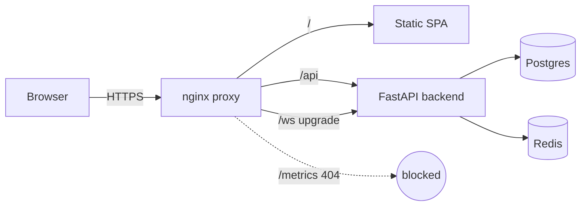
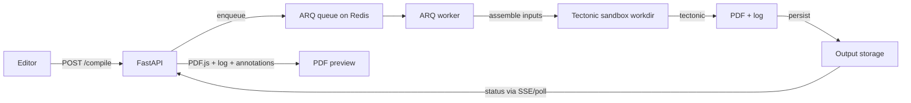
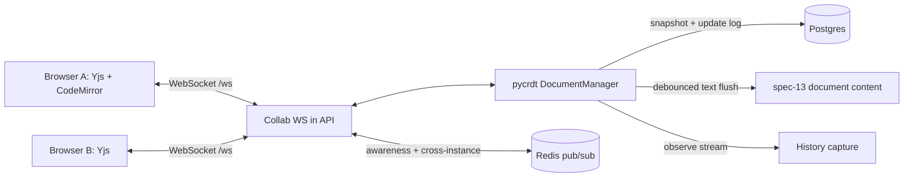
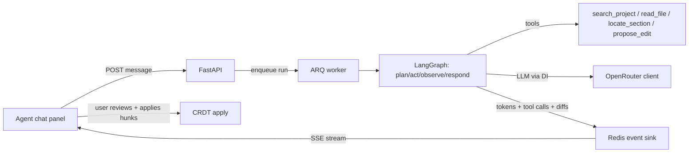

# Inkstave — Architecture

How Inkstave's pieces fit together. For operating it see the
[Admin Guide](admin-guide.md); for using it see the [User Guide](user-guide.md).

## Service inventory

Inkstave runs one process per container (spec 56). The same `inkstave-backend`
image runs three of them, selected by command:

| Service | Image | Responsibility |
| --- | --- | --- |
| **frontend** | `inkstave-frontend` | nginx serving the React/Vite SPA + reverse-proxying `/api` and `/ws`; blocks `/metrics`. |
| **backend (API)** | `inkstave-backend` | FastAPI REST API: auth, projects, files/documents, compile orchestration, history, sharing, agent endpoints, health/metrics. |
| **worker** | `inkstave-backend` | ARQ jobs: LaTeX compiles, the AI agent turn, email, history compaction, retention sweeps. |
| **collab (in-app)** | `inkstave-backend` | The CRDT WebSocket lives inside the API process, so `/ws` routes to `backend` (no separate service). |
| **postgres** | `postgres:16-alpine` | System of record: users, projects, documents, CRDT history, agent data, audit. |
| **redis** | `redis:7-alpine` | ARQ broker, hot-read cache, rate-limit counters, collab cross-instance pub/sub. |
| **Tectonic** | (in backend image) | The LaTeX engine invoked by the compile sandbox; packages cached in a volume. |

## Data-flow diagrams

### Request flow

### Compile flow

### Collaboration / CRDT flow

### Agent flow

## Data model overview

The principal entities (consistent with the Alembic migrations under
`backend/migrations/versions/`):

- **User** — account with an argon2 password hash and an `is_admin` flag; owns
  projects.
- **Project** — owned by a user; has **memberships** (owner/editor/viewer) and
  pending **invites** for sharing.
- **TreeEntity** — the file tree (folders, documents, binary files) under a
  project. A **Document** holds a `.tex` file's text content (the spec-13
  materialized content), while **File** rows track uploaded binaries.
- **CRDT history** — per-document `history_chunks` (base snapshot + ordered
  incremental updates), with large payloads offloaded to blob storage; powers the
  version timeline, diff and restore. Separate `crdt` snapshot/update tables back
  live collaboration.
- **Compile** + **CompileOutput** — a compile request and its produced
  PDF/log/artifacts, with retention.
- **AgentSession / AgentMessage / ProposedDiff / AgentAuditLog** — the AI agent's
  conversations, the per-file diffs it proposes (never auto-applied), and the
  safety audit trail.
- **Notification** — invite/share notifications.

## Architecture Decision Records

Per-spec ADRs live under [`docs/adr/`](adr/) — each records a concrete design
choice and its trade-offs. Highlights:

- [0001 — tooling choices](adr/0001-tooling-choices.md)
- [0021 — compile sandbox](adr/0021-compile-sandbox.md)
- [0028 — CRDT collaboration](adr/0028-crdt-collab.md)
- [0041 — agent foundation](adr/0041-agent-foundation.md)
- [0051 — observability](adr/0051-observability.md)
- [0056 — Docker production](adr/0056-docker-production.md)
- [0057 — CI/CD & bootstrap](adr/0057-cicd-bootstrap.md)

Refactor passes are logged under [`docs/refactors/`](refactors/), and the e2e
strategy in [docs/e2e-strategy.md](e2e-strategy.md).
